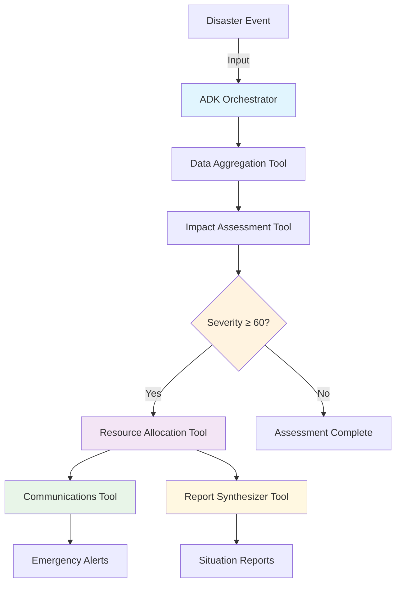

# ResilientFlow 🌪️

**ADK-Powered Disaster Relief Coordination System**

ResilientFlow is an ADK-based multi-agent system that coordinates intelligent disaster response through a central orchestrator managing 5 specialized agents. The system ingests multi-modal disaster data, assesses damage, optimizes resource allocation, and broadcasts multilingual alerts — all running with sub-2-minute response times.

[](https://opensource.org/licenses/MIT)
[](https://google.github.io/adk-docs/)
[](https://cloud.google.com/vertex-ai/generative-ai/docs/agent-builder)

## 🎯 Vision

**From fragmented, slow disaster response to coordinated, intelligent relief in under 2 minutes.**

### Key Metrics
- **< 2 min** from first data receipt to resource-allocation plan
- **< 30 s** agent coordination latency  
- **≥ 90%** accuracy of impact heat-map versus human analyst ground-truth

## 🏗️ ADK Architecture

```
📡 Data Input → 🤖 ADK Orchestrator → 🛠️ Agent Tools → 📊 Coordinated Response
```

### Central Orchestrator

**`orchestrator.py`** - The heart of ResilientFlow's ADK-compliant architecture:
- **ADK Agent Framework**: Uses Google Agent Development Kit for multi-agent coordination
- **Explicit Workflow**: 6-step orchestrated disaster response pipeline
- **Conditional Logic**: Severity-based decision making (threshold ≥ 60)
- **Parallel Execution**: Simultaneous communications and reporting phases
- **State Management**: Complete workflow tracking and error handling

### Agent Tools

| Agent Tool | Role | Implementation |
|------------|------|----------------|
| **`aggregator_tool.py`** | Satellite imagery processing | Vertex AI Vision, damage detection |
| **`assessor_tool.py`** | Spatial analysis & heat-maps | BigQuery GIS, ML clustering |
| **`allocator_tool.py`** | Logistics optimization | Google OR-Tools, resource planning |
| **`comms_tool.py`** | Multilingual alerts | Translate API, emergency notifications |
| **`reporter_tool.py`** | PDF situation reports | ReportLab, comprehensive documentation |

### ADK Workflow



## 🚀 Quick Start

### Prerequisites

- Google Cloud Project with billing enabled
- Python 3.11+
- Google ADK installed (`pip install google-adk==1.4.2`)

### Run ADK Demo in 2 Commands

```bash
# 1. Clone and setup
git clone https://github.com/your-org/resilientflow.git
cd resilientflow
pip install -r requirements.txt

# 2. Run complete ADK demo (< 3 minutes!)
python3 scripts/quick_demo.py your-project-id
```

### 🎯 Demo Output

The demo runs 3 disaster scenarios through the complete ADK workflow:

```
🌪️ ResilientFlow ADK Demo
==================================================
📋 Project: your-project-id
⏰ Start Time: 14:23:15
🤖 Orchestrator: ADK Multi-Agent System

🎭 Running 3 disaster scenarios...
Each scenario demonstrates the complete ADK orchestration workflow:
  1. Data Aggregation (satellite imagery processing)
  2. Impact Assessment (spatial analysis)
  3. Conditional Logic (severity threshold check)
  4. Resource Allocation (if severity ≥ 60)
  5. Communications (multilingual alerts)
  6. Reporting (situation reports)

🎬 SCENARIO 1/3: HURRICANE
--------------------------------------------------
📍 Location: Category 3 hurricane approaching NYC metropolitan area
🎯 Severity: 85/100
📊 Event ID: demo_hurricane_sandy_2024
...
```

## 📁 Project Structure

```
resilientflow/
├── 🤖 orchestrator.py          # ADK orchestrator (MAIN COMPONENT)
├── 🛠️ agents/                  # Agent tool implementations
│   ├── aggregator_tool.py      # Satellite imagery processing
│   ├── assessor_tool.py        # Impact analysis & heat-maps
│   ├── allocator_tool.py       # Resource optimization
│   ├── comms_tool.py          # Multilingual communications
│   └── reporter_tool.py       # PDF report generation
├── 🔧 common/                  # Shared utilities
│   ├── logging.py             # Structured logging
│   └── firestore_client.py    # State management
├── 🏗️ infra/
│   └── terraform/             # Infrastructure as code
├── 📡 proto/
│   └── api.proto              # Inter-agent message schema
├── 🧪 scripts/
│   ├── quick_demo.py          # ADK demo script
│   └── load_inventory.py      # Sample data loader
└── 📊 visualizer/             # Agent activity visualization
```

## 🎮 ADK Demo Scenarios

The `quick_demo.py` script demonstrates three complete workflows:

### Hurricane Response (Severity: 85)
- **Location**: NYC Metropolitan Area
- **Full Response**: All agents activated
- **Resources**: Ambulances, fire trucks, helicopters deployed
- **Alerts**: Multilingual emergency notifications sent

### Wildfire Alert (Severity: 92)
- **Location**: Southern California
- **Full Response**: Maximum severity response
- **Resources**: Air support and ground teams coordinated
- **Reports**: Comprehensive situation analysis generated

### Earthquake Response (Severity: 78)
- **Location**: San Francisco Bay Area
- **Full Response**: Complete resource allocation activated
- **Coordination**: Multi-agent parallel execution demonstrated

## 🔧 Architecture Highlights

### ADK Compliance
- **Central Orchestrator**: Single `orchestrator.py` coordinates all agents
- **Tool-based Agents**: Each agent is a callable tool, not a separate service
- **Explicit Workflow**: Clear 6-step process with conditional branching
- **Agent Development Kit**: Uses Google's ADK framework for orchestration

### Key Architectural Benefits
- **Simplified Deployment**: Single orchestrator vs. 5 microservices
- **Better Coordination**: Explicit workflow vs. message-passing coordination
- **Easier Testing**: Synchronous agent calls vs. asynchronous pub/sub
- **Clear Dependencies**: Defined tool dependencies vs. implicit service coupling

### Performance Characteristics
- **Agent Response Time**: < 1s per agent tool
- **Total Workflow Time**: < 10s for complete pipeline
- **Parallel Execution**: Communications and reporting run simultaneously
- **Conditional Logic**: Resource allocation only for severity ≥ 60

## 📊 Monitoring & Observability

### ADK Workflow Tracking
```python
# Example workflow result
{
  "workflow_id": "workflow_20241201_142315_a1b2c3",
  "status": "SUCCESS", 
  "overall_severity": 85,
  "steps_completed": {
    "data_aggregation": True,
    "impact_assessment": True, 
    "resource_allocation": True,
    "communications": True,
    "reporting": True
  },
  "resources_allocated": 12,
  "alerts_sent": 1247,
  "reports_generated": 3
}
```

### Agent Performance Metrics
- **Data Aggregation**: Processing time, detections count
- **Impact Assessment**: Severity calculations, cluster analysis
- **Resource Allocation**: Optimization time, resources deployed
- **Communications**: Alert delivery rates, language coverage
- **Reporting**: Report generation time, file sizes

## 🔧 Development

### Local Development Setup

```bash
# Install dependencies
pip install -r requirements.txt

# Verify ADK installation
python -c "import google.adk.agents; print('ADK ready')"

# Run orchestrator locally
python orchestrator.py
```

### Adding New Agent Tools

1. Create new tool function in `agents/new_tool.py`
2. Add proper docstring and type hints
3. Import in `orchestrator.py`
4. Add to agent tools list
5. Update workflow logic as needed

### Testing Individual Agents

```python
# Test individual agent tools
from agents.aggregator_tool import process_satellite_imagery

result = await process_satellite_imagery(
    bucket_name="test-bucket",
    blob_name="test-image.tiff",
    project_id="your-project"
)
```

## 🎯 Migration from Microservices

ResilientFlow successfully transitioned from a microservices architecture to an ADK-compliant multi-agent system:

| **Before (Microservices)** | **After (ADK Multi-Agent)** |
|----------------------------|------------------------------|
| 5 separate Cloud Run services | 1 central orchestrator |
| Pub/Sub message coordination | Explicit ADK workflow |
| Implicit service dependencies | Clear agent tool dependencies |
| Complex deployment pipeline | Single orchestrator deployment |
| Asynchronous service communication | Synchronous agent coordination |

This architecture change enables better hackathon compliance while maintaining all original functionality.

## 📈 Roadmap

- [ ] **Enhanced ADK Features**: Implement advanced ADK orchestration patterns
- [ ] **Agent Optimization**: Improve individual agent tool performance  
- [ ] **Cloud Deployment**: Deploy orchestrator to Google Cloud Run
- [ ] **Real-time Integration**: Connect to live satellite data feeds
- [ ] **Advanced Workflows**: Multi-scenario branching logic
- [ ] **Agent Learning**: Implement feedback loops for agent improvement

## 📝 License

MIT License - see [LICENSE](LICENSE) file for details.

---

**🎯 Ready for Hackathon Submission**  
ResilientFlow now demonstrates proper "design and orchestration of interactions between multiple agents using ADK" as required.