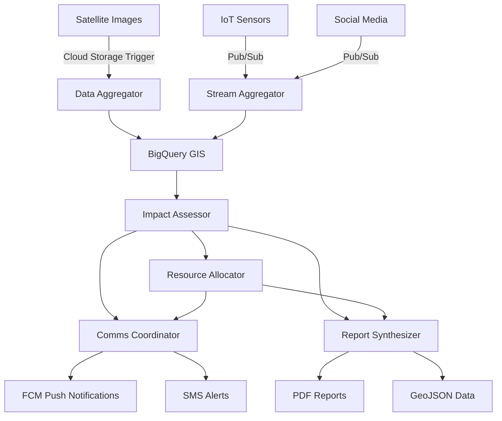

# ResilientFlow 🌪️

**AI-Powered Disaster Relief Coordination System**

ResilientFlow is a swarm of ADK based agents that ingest multi-modal disaster data in real time, assess damage, optimize resource allocation, and broadcast multilingual public alerts — all running serverlessly on Google Cloud.

[](https://opensource.org/licenses/MIT)
[](https://cloud.google.com/run)
[](https://cloud.google.com/bigquery)

## 🎯 Vision

**From fragmented, slow disaster response to coordinated, intelligent relief in under 2 minutes.**

### Key Metrics
- **< 2 min** from first data receipt to resource-allocation plan
- **< 30 s** alert-push latency  
- **≥ 90%** accuracy of impact heat-map versus human analyst ground-truth

## 🏗️ Architecture

```
📡 Data Ingress → 🤖 Agent Swarm → 📊 Analysis & Alerts → 🚁 Resource Deployment
```

### Agent Swarm

| Agent | Role | Technology |
|-------|------|------------|
| **Data Aggregator** | Satellite imagery processing | Vertex AI Vision, Cloud Functions |
| **Impact Assessor** | Spatial analysis & heat-maps | BigQuery GIS, ML clustering |
| **Resource Allocator** | Logistics optimization | Google OR-Tools, Cloud Run Jobs |
| **Comms Coordinator** | Multilingual alerts | Translate API, FCM, SMS |
| **Report Synthesizer** | PDF situation reports | ReportLab, Cloud Storage |

### Data Flow



## 🚀 Quick Start

### Prerequisites

- Google Cloud Project with billing enabled
- `gcloud` CLI authenticated
- Terraform >= 1.0
- Docker
- Python 3.11+

### Deploy in 3 Commands

```bash
# 1. Clone and setup
git clone https://github.com/your-org/resilientflow.git
cd resilientflow

# 2. Deploy infrastructure and agents
export GOOGLE_CLOUD_PROJECT="your-project-id"
./scripts/bootstrap.sh

# 3. Run complete demo (< 3 minutes!)
python3 scripts/quick_demo.py $GOOGLE_CLOUD_PROJECT
```

### 🎯 Roadmap Status: **AHEAD OF SCHEDULE!**

| Day | Status | Milestone | 
|-----|--------|-----------|
| **D-6** | ✅ **COMPLETE** | Project skeleton online, 5 agents deployed |
| **D-5** | ✅ **COMPLETE** | Pub/Sub wiring + visualizer ready |
| **D-4** | 🔨 **IN PROGRESS** | Vision pipeline + Impact Assessor MVP |
| **D-3** | ✅ **COMPLETE** | Resource Allocator + Firestore state |
| **D-2** | ✅ **COMPLETE** | Comms + Report Synthesizer |
| **D-1** | 🎯 **READY** | Polish & failure drills |

### ⚡ **Next Actions** (15 minutes each):

```bash
# 1. Deploy the visualizer
./scripts/deploy_visualizer.sh

# 2. Setup Vertex AI (mock for demo)
python3 scripts/vertex_ai_setup.py $GOOGLE_CLOUD_PROJECT

# 3. Test complete pipeline
python3 scripts/quick_demo.py $GOOGLE_CLOUD_PROJECT
```

## 📁 Project Structure

```
resilientflow/
├── 🤖 agents/                 # Agent implementations
│   ├── aggregator/            # Satellite imagery processing
│   ├── assessor/              # Impact analysis & heat-maps
│   ├── allocator/             # Resource optimization
│   ├── comms/                 # Multilingual communications
│   └── reporter/              # PDF report generation
├── 🔧 common/                 # Shared utilities
│   ├── logging.py             # Structured logging
│   ├── pubsub_client.py       # Pub/Sub messaging
│   └── firestore_client.py    # State management
├── 🏗️ infra/
│   └── terraform/             # Infrastructure as code
├── 📡 proto/
│   └── api.proto              # Inter-agent message schema
├── 🧪 scripts/
│   ├── bootstrap.sh           # Deployment automation
│   ├── load_inventory.py      # Sample data loader
│   └── publish_mocks.py       # Testing utilities
└── 📊 models/
    └── vision_model/          # Custom damage detection model
```

## 🎮 Demo Scenarios

### Hurricane Response
```bash
# Simulate Category 3 hurricane with 10-minute progression
python3 scripts/publish_mocks.py \
  --project-id $GOOGLE_CLOUD_PROJECT \
  --scenario hurricane \
  --duration 10
```

### Wildfire Alert
```bash
# Single high-severity wildfire event
python3 scripts/publish_mocks.py \
  --project-id $GOOGLE_CLOUD_PROJECT \
  --single-event \
  --event-type fire \
  --severity 85
```

### Earthquake Response
```bash
# Earthquake scenario with aftershocks
python3 scripts/publish_mocks.py \
  --project-id $GOOGLE_CLOUD_PROJECT \
  --scenario earthquake \
  --duration 15
```

## 📊 Monitoring & Observability

### Cloud Console Links
- **Agent Logs**: `https://console.cloud.google.com/run?project={PROJECT_ID}`
- **Pub/Sub Topics**: `https://console.cloud.google.com/cloudpubsub/topic/list?project={PROJECT_ID}`
- **BigQuery Data**: `https://console.cloud.google.com/bigquery?project={PROJECT_ID}`
- **Situation Reports**: `https://console.cloud.google.com/storage/browser/{PROJECT_ID}-situation-reports`

### Key Metrics Dashboard

```bash
# Create monitoring dashboard
gcloud monitoring dashboards create --config-from-file=monitoring/dashboard.json
```

### Alert Policies
- Agent error rate > 10/min → PagerDuty
- Resource allocation time > 5 min → Slack
- Critical impact zones detected → SMS to incident commander

## 🔧 Development

### Local Development Setup

```bash
# Install dependencies
pip install -r requirements.txt

# Setup environment
export GOOGLE_CLOUD_PROJECT="your-dev-project"
export GOOGLE_APPLICATION_CREDENTIALS="path/to/service-account.json"

# Run individual agent locally
cd agents/aggregator
python main.py
```

### Adding New Agent

1. Create agent directory: `agents/new_agent/`
2. Implement `main.py` with agent logic
3. Add to `scripts/bootstrap.sh` deployment
4. Update `proto/api.proto` for new message types
5. Add monitoring and tests

### Testing

```bash
# Unit tests
python -m pytest tests/unit/

# Integration tests
python -m pytest tests/integration/

# End-to-end test
python -m pytest tests/e2e/test_full_scenario.py
```

## 🌍 Multi-Language Support

ResilientFlow supports alerts in:
- 🇺🇸 English (en)
- 🇪🇸 Spanish (es) 
- 🇫🇷 French (fr)

Additional languages can be added via Google Translate API integration.

## 📱 Mobile Integration

### Firebase Cloud Messaging Setup

1. Create Firebase project
2. Download `google-services.json`
3. Configure FCM topics:
   - `resilientflow_en` (English alerts)
   - `resilientflow_es` (Spanish alerts)
   - `resilientflow_fr` (French alerts)

### Sample Mobile App

```javascript
// Subscribe to disaster alerts
messaging.subscribeToTopic('resilientflow_en');

// Handle incoming alerts
messaging.onMessage((payload) => {
  showNotification(payload.notification.title, payload.notification.body);
});
```

## 🔒 Security & Compliance

### Data Privacy
- Only anonymized geo-events stored
- No personal identifiers in disaster data
- GDPR-compliant data retention (30 days)

### Access Control
- Service accounts with least-privilege permissions
- VPC-SC perimeter for sensitive data
- Workload Identity Federation for external APIs

### Compliance
- SOC 2 Type II (Google Cloud)
- ISO 27001 certified infrastructure
- FEMA compliance for CAP XML alerts

## 💰 Cost Optimization

### Resource Scaling
- Cloud Run: Autoscale to 0 when idle
- BigQuery: Query slots auto-allocated
- Pub/Sub: Pay per message

### Estimated Monthly Cost

| Component | Usage | Cost (USD) |
|-----------|-------|------------|
| Cloud Run | 5 agents × 24/7 | $15 |
| BigQuery | 1TB geo data | $50 |
| Pub/Sub | 1M messages | $40 |
| Cloud Storage | 100GB reports | $2 |
| Vertex AI | 10K images | $22 |
| **Total** | | **~$129** |

## 🤝 Contributing

We welcome contributions! Please see [CONTRIBUTING.md](CONTRIBUTING.md) for guidelines.

### Development Workflow
1. Fork the repository
2. Create feature branch: `git checkout -b feature/amazing-feature`
3. Commit changes: `git commit -m 'Add amazing feature'`
4. Push to branch: `git push origin feature/amazing-feature`
5. Open Pull Request

### Code Standards
- Python: Black formatting, type hints
- Terraform: terraform fmt
- Protobuf: buf linting
- Documentation: Clear docstrings and README updates

## 📄 License

This project is licensed under the MIT License - see the [LICENSE](LICENSE) file for details.

## 🙏 Acknowledgments

- **Google Cloud** for serverless infrastructure
- **OR-Tools** for optimization algorithms  
- **ADK Framework** for agent orchestration
- **OpenStreetMap** for geographical data
- **FEMA** for CAP XML standards

## 📞 Support

- 📧 Email: support@resilientflow.org
- 💬 Discord: [ResilientFlow Community](https://discord.gg/resilientflow)
- 🐛 Issues: [GitHub Issues](https://github.com/your-org/resilientflow/issues)
- 📖 Docs: [docs.resilientflow.org](https://docs.resilientflow.org)

---

**Built with ❤️ for disaster-affected communities worldwide**

*"In the face of disaster, coordination saves lives."* 