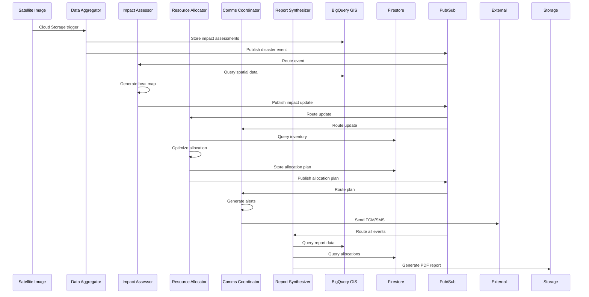

# ResilientFlow Architecture

## Overview

ResilientFlow is a distributed system of AI agents designed for real-time disaster relief coordination. The system ingests multi-modal data (satellite imagery, IoT sensors, social media), performs spatial analysis, optimizes resource allocation, and generates multilingual alerts — all within sub-2-minute response times.

## System Architecture

### High-Level Design

```
┌─────────────────┐    ┌─────────────────┐    ┌─────────────────┐
│   Data Sources  │    │   Agent Swarm   │    │   Outputs       │
│                 │    │                 │    │                 │
│ • Satellite     │───▶│ • Data Aggr.    │───▶│ • Alerts        │
│ • IoT Sensors   │    │ • Impact Assess │    │ • Allocations   │
│ • Social Media  │    │ • Resource All. │    │ • Reports       │
│ • Gov Feeds     │    │ • Comms Coord.  │    │ • Heat Maps     │
│                 │    │ • Report Synth. │    │                 │
└─────────────────┘    └─────────────────┘    └─────────────────┘
```

### Agent Interaction Flow



## Agent Specifications

### 1. Data Aggregator Agent

**Purpose**: Process satellite imagery and sensor data for damage detection

**Technology Stack**:
- Google Cloud Functions (event triggers)
- Vertex AI Vision (custom damage detection model)
- Cloud Storage (image processing)
- BigQuery GIS (spatial data storage)

**Processing Pipeline**:
1. **Image Ingestion**: Cloud Storage trigger → download image
2. **Preprocessing**: Format validation, metadata extraction
3. **ML Inference**: Vertex AI Vision damage detection
4. **Spatial Processing**: Convert detections to geo-referenced assessments
5. **Data Storage**: Insert into BigQuery `impact_assessments` table
6. **Event Publishing**: Critical detections → Pub/Sub `disaster_events`

**Performance Requirements**:
- Process 1000+ images/hour during peak events
- < 30s processing time per satellite image
- 95% uptime during disaster scenarios

### 2. Impact Assessor Agent

**Purpose**: Spatial analysis and heat map generation from multi-source data

**Technology Stack**:
- BigQuery GIS (spatial queries and ML)
- Cloud Run (scalable compute)
- Pub/Sub (event-driven processing)

**Processing Pipeline**:
1. **Data Aggregation**: Spatial JOIN of `images.assessments` + `events.*`
2. **Clustering**: K-means clustering using BigQuery ML
3. **Severity Calculation**: Weighted scoring based on:
   - Damage type severity multipliers
   - Confidence scores
   - Temporal decay functions
   - Population density (from external datasets)
4. **Heat Map Generation**: Grid-based severity tiles
5. **Zone Creation**: Aggregate clusters into actionable impact zones

**Spatial Resolution**:
- Grid size: 0.001° (~100m at equator)
- Clustering distance: 1.0 km
- Update frequency: 30 seconds during active incidents

### 3. Resource Allocator Agent

**Purpose**: Optimize logistics and resource allocation using OR-Tools

**Technology Stack**:
- Google OR-Tools (optimization engine)
- Cloud Run Jobs (batch processing)
- Firestore (inventory and state management)

**Optimization Model**:
```python
# Vehicle Routing Problem with Capacity Constraints
objective = minimize(
    sum(travel_time[i,j] * x[i,j] for i,j in routes) +
    sum(unmet_demand[r] * penalty[r] for r in resources)
)

constraints = [
    # Vehicle capacity
    sum(demand[d] * assigned[v,d] for d in demands) <= capacity[v],
    
    # Demand coverage
    sum(assigned[v,d] for v in vehicles) >= min_coverage[d],
    
    # Resource availability
    sum(allocated[r,f] for f in facilities) <= inventory[r]
]
```

**Optimization Parameters**:
- Timeout: 30 seconds for real-time decisions
- Coverage target: ≥ 85% of critical zones
- Vehicle types: truck (5000kg), helicopter (1000kg), boat (3000kg)

### 4. Communications Coordinator Agent

**Purpose**: Generate and distribute multilingual alerts

**Technology Stack**:
- Google Translate API (multilingual support)
- Firebase Cloud Messaging (mobile push)
- Cloud Text-to-Speech (audio alerts)
- External SMS/social media APIs

**Alert Generation Pipeline**:
1. **Event Classification**: Severity → urgency mapping
2. **Template Selection**: Event type → message template
3. **Localization**: Translate to supported languages (en, es, fr)
4. **Distribution**:
   - FCM: Mobile push notifications
   - SMS: Emergency text alerts
   - CAP XML: FEMA-compliant alert format
   - Social Media: Twitter/Facebook posts

**Message Formats**:
```xml
<!-- CAP XML Example -->
<alert xmlns="urn:oasis:names:tc:emergency:cap:1.2">
  <identifier>resilientflow.emergency.flood_nyc_20241201_001</identifier>
  <sender>resilientflow@emergency.gov</sender>
  <status>Actual</status>
  <msgType>Alert</msgType>
  <scope>Public</scope>
  <info>
    <language>en-US</language>
    <category>Geo</category>
    <event>Flood</event>
    <urgency>Immediate</urgency>
    <severity>Severe</severity>
    <certainty>Observed</certainty>
  </info>
</alert>
```

### 5. Report Synthesizer Agent

**Purpose**: Generate comprehensive PDF situation reports

**Technology Stack**:
- ReportLab (PDF generation)
- Matplotlib (data visualization)
- Google Maps Static API (map overlays)
- Cloud Storage (report distribution)

**Report Components**:
1. **Executive Summary**: Key metrics and status
2. **Impact Assessment**: Heat maps and severity analysis
3. **Resource Allocation**: Logistics tables and route maps
4. **Agent Activity**: System health and processing stats
5. **Appendices**: Raw data exports and technical details

**Report Types**:
- **Immediate Reports**: Generated on critical events (< 5 min)
- **Periodic Reports**: Scheduled every 30 minutes during incidents
- **Final Reports**: Post-incident analysis and lessons learned

## Data Architecture

### BigQuery GIS Schema

```sql
-- Impact Assessments Table
CREATE TABLE resilientflow.impact_assessments (
  assessment_id STRING NOT NULL,
  latitude FLOAT64 NOT NULL,
  longitude FLOAT64 NOT NULL,
  grid_cell_id STRING NOT NULL,
  severity_score INT64 NOT NULL,
  damage_type STRING NOT NULL,
  confidence_scores JSON,
  assessed_timestamp TIMESTAMP NOT NULL,
  source_agent STRING NOT NULL
)
PARTITION BY DATE(assessed_timestamp)
CLUSTER BY grid_cell_id, damage_type;

-- Impact Zones Table
CREATE TABLE resilientflow.impact_zones (
  zone_id STRING NOT NULL,
  center_latitude FLOAT64 NOT NULL,
  center_longitude FLOAT64 NOT NULL,
  severity_score FLOAT64 NOT NULL,
  affected_area_km2 FLOAT64,
  damage_types ARRAY<STRING>,
  assessment_count INT64,
  confidence FLOAT64,
  last_updated TIMESTAMP NOT NULL,
  geojson_polygon STRING
)
PARTITION BY DATE(last_updated)
CLUSTER BY severity_score;
```

### Firestore Collections

```javascript
// Inventory Collection
{
  "inventory": {
    "{facility_id}_{resource_type}": {
      "facility_id": "warehouse_nyc_001",
      "resource_type": "water",
      "quantity": 5000,
      "capacity": 10000,
      "last_updated_ms": 1701234567890,
      "updated_by": "resource_allocator"
    }
  },
  
  // Allocation Plans Collection
  "allocations": {
    "{plan_id}": {
      "plan_id": "plan_20241201_001",
      "incident_id": "hurricane_sandy_2024",
      "allocations": [
        {
          "allocation_id": "alloc_001",
          "resource_type": "water",
          "quantity": 1000,
          "from_facility": "warehouse_nyc_001",
          "to_zone": "zone_manhattan_001",
          "status": "planned",
          "vehicle_id": "truck_001"
        }
      ],
      "status": "active",
      "created_ms": 1701234567890
    }
  }
}
```

## Pub/Sub Topics and Message Flow

### Topic Architecture

```
rf-disaster-events     → High-priority disaster detections
rf-impact-updates      → Spatial analysis updates
rf-allocation-plans    → Resource optimization results
rf-alert-broadcasts    → Public alert distribution
rf-agent-events        → System monitoring and coordination
```

### Message Schemas (Protobuf)

```protobuf
message DisasterEvent {
  string event_id = 1;
  string source_agent = 2;
  double latitude = 3;
  double longitude = 4;
  string event_type = 5;  // "flood" | "fire" | "earthquake"
  int32 severity_raw = 6; // 0-100
  int64 timestamp_ms = 7;
}

message ImpactAssessment {
  string assessment_id = 1;
  double latitude = 2;
  double longitude = 3;
  string grid_cell_id = 4;
  int32 severity_score = 5;
  string damage_type = 6;
  map<string, double> confidence_scores = 7;
  int64 assessed_ms = 8;
}
```

## Deployment and Scaling

### Cloud Run Configuration

| Agent | Memory | CPU | Min Instances | Max Instances | Concurrency |
|-------|--------|-----|---------------|---------------|-------------|
| Data Aggregator | 2Gi | 1 | 0 | 10 | 10 |
| Impact Assessor | 2Gi | 1 | 0 | 10 | 5 |
| Resource Allocator | 2Gi | 2 | 0 | 5 | 1 |
| Comms Coordinator | 1Gi | 1 | 1 | 10 | 50 |
| Report Synthesizer | 2Gi | 1 | 0 | 5 | 2 |

### Auto-scaling Triggers

```yaml
# Example Cloud Run service configuration
apiVersion: serving.knative.dev/v1
kind: Service
metadata:
  name: impact-assessor
  annotations:
    run.googleapis.com/cpu-throttling: "false"
spec:
  template:
    metadata:
      annotations:
        autoscaling.knative.dev/minScale: "0"
        autoscaling.knative.dev/maxScale: "10"
        autoscaling.knative.dev/target: "5"
    spec:
      containerConcurrency: 5
      timeoutSeconds: 300
```

## Security Architecture

### Network Security

- **VPC-SC Perimeter**: Protects BigQuery and Cloud Storage
- **Private Google Access**: No public IPs for compute resources
- **IAM Policies**: Least-privilege service accounts per agent

### Data Protection

- **Encryption**: At-rest (Google-managed) and in-transit (TLS 1.3)
- **Access Controls**: Resource-level IAM with audit logging
- **Data Retention**: 30-day automatic deletion for GDPR compliance

### Service Account Permissions

```bash
# Data Aggregator permissions
gcloud projects add-iam-policy-binding $PROJECT_ID \
  --member="serviceAccount:data-aggregator@$PROJECT_ID.iam.gserviceaccount.com" \
  --role="roles/storage.objectViewer" \
  --role="roles/bigquery.dataEditor" \
  --role="roles/aiplatform.user"

# Resource Allocator permissions
gcloud projects add-iam-policy-binding $PROJECT_ID \
  --member="serviceAccount:resource-allocator@$PROJECT_ID.iam.gserviceaccount.com" \
  --role="roles/datastore.user" \
  --role="roles/pubsub.publisher"
```

## Monitoring and Observability

### Key Metrics

| Metric | SLI | SLO | Alert Threshold |
|--------|-----|-----|-----------------|
| End-to-end latency | 95th %ile ≤ 120s | 99% of days | > 180s |
| Alert delivery rate | ≥ 99% | 7-day rolling | < 95% |
| Data freshness | ≤ 5 min lag | Active incidents | > 10 min |
| Agent availability | ≥ 99.9% uptime | Monthly | < 99% |

### Logging Strategy

```python
# Structured logging example
logger.info(
    "Agent action completed",
    {
        "action": "process_satellite_image",
        "status": "success", 
        "duration_ms": 1234,
        "correlation_id": "abc-123",
        "agent": "data_aggregator",
        "image_size_mb": 45.2,
        "detections_count": 3
    }
)
```

### Alerting Rules

```yaml
# Cloud Monitoring alert policy
displayName: "ResilientFlow Agent Errors"
conditions:
  - displayName: "High error rate"
    conditionThreshold:
      filter: 'resource.type="cloud_run_revision" AND severity="ERROR"'
      comparison: COMPARISON_GT
      thresholdValue: 10
      duration: 300s
      aggregations:
        - alignmentPeriod: 60s
          perSeriesAligner: ALIGN_RATE
```

## Performance Optimization

### Caching Strategy

- **BigQuery**: Materialized views for frequent spatial queries
- **Firestore**: Local caching of inventory data (5-minute TTL)
- **Pub/Sub**: Message deduplication with 10-minute retention

### Query Optimization

```sql
-- Optimized spatial query for impact assessment
SELECT 
  assessment_id,
  ST_DISTANCE(ST_GEOGPOINT(longitude, latitude), 
              ST_GEOGPOINT(@center_lon, @center_lat)) as distance_m,
  severity_score
FROM `resilientflow.impact_assessments`
WHERE 
  ST_DWITHIN(ST_GEOGPOINT(longitude, latitude),
             ST_GEOGPOINT(@center_lon, @center_lat), 
             @radius_m)
  AND assessed_timestamp >= TIMESTAMP_SUB(CURRENT_TIMESTAMP(), INTERVAL 24 HOUR)
ORDER BY severity_score DESC, distance_m ASC
LIMIT 1000
```

### Cost Optimization

- **Cloud Run**: Scale-to-zero during idle periods
- **BigQuery**: Query result caching and slot reservations
- **Cloud Storage**: Lifecycle policies for old reports (30-day deletion)

## Disaster Recovery

### Data Backup

- **BigQuery**: Cross-region replication to `us-west1`
- **Firestore**: Daily exports to Cloud Storage
- **Cloud Storage**: Multi-region buckets with versioning

### Service Continuity

- **Multi-region deployment**: Primary in `us-central1`, failover to `us-east1`
- **Circuit breakers**: Graceful degradation when external services fail
- **Offline mode**: Local caching enables 1-hour autonomous operation

### Recovery Procedures

```bash
# Emergency failover script
#!/bin/bash
echo "Initiating emergency failover to us-east1..."

# Redirect traffic to backup region
gcloud compute url-maps set-default-service resilientflow-lb \
  --default-service=resilientflow-backend-east

# Scale up backup instances
gcloud run services update-traffic data-aggregator \
  --to-revisions=LATEST=100 \
  --region=us-east1

echo "Failover complete. Monitor recovery at:"
echo "https://console.cloud.google.com/run?project=$PROJECT_ID"
```

This architecture enables ResilientFlow to meet its performance targets of sub-2-minute response times while maintaining 99.9% availability during disaster scenarios. 