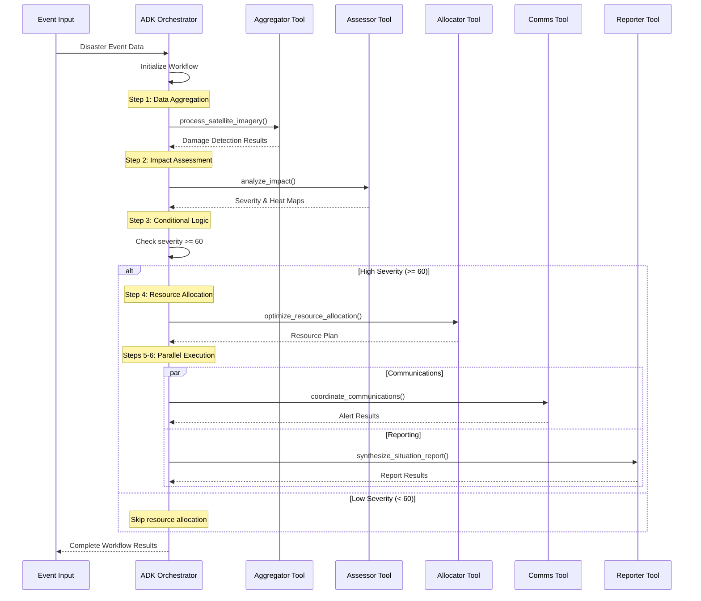

# ResilientFlow ADK Architecture

## Overview

ResilientFlow is an ADK-based multi-agent system designed for real-time disaster relief coordination. The system uses a central orchestrator to coordinate 5 specialized agent tools that ingest multi-modal data (satellite imagery, IoT sensors, social media), perform spatial analysis, optimize resource allocation, and generate multilingual alerts — all within sub-2-minute response times.

## ADK-Based Architecture

### High-Level Design

```
┌─────────────────┐    ┌─────────────────┐    ┌─────────────────┐
│   Data Sources  │    │ ADK Orchestrator│    │   Outputs       │
│                 │    │                 │    │                 │
│ • Satellite     │───▶│ orchestrator.py │───▶│ • Alerts        │
│ • IoT Sensors   │    │                 │    │ • Allocations   │
│ • Social Media  │    │ Agent Tools:    │    │ • Reports       │
│ • Gov Feeds     │    │ • Aggregator    │    │ • Heat Maps     │
│                 │    │ • Assessor      │    │                 │
│                 │    │ • Allocator     │    │                 │
│                 │    │ • Communications│    │                 │
│                 │    │ • Reporter      │    │                 │
└─────────────────┘    └─────────────────┘    └─────────────────┘
```

### Central Orchestrator

**`orchestrator.py`** is the heart of ResilientFlow's ADK architecture:

- **ADK Agent Framework**: Uses Google Agent Development Kit for multi-agent coordination
- **DisasterResponseAgent**: Main ADK agent that orchestrates the workflow
- **Explicit Workflow**: 6-step disaster response pipeline with conditional logic
- **State Management**: Complete workflow tracking and error handling
- **Parallel Execution**: Simultaneous communications and reporting phases

### ADK Workflow Sequence



## Agent Tool Specifications

### 1. Data Aggregator Tool (`aggregator_tool.py`)

**Purpose**: Process satellite imagery and sensor data for damage detection

**Function Signature**:
```python
async def process_satellite_imagery(
    bucket_name: str = None,
    blob_name: str = None,
    project_id: str = None,
    region: str = 'us-central1'
) -> Dict[str, Any]
```

**Technology Stack**:
- Vertex AI Vision (custom damage detection model)
- Cloud Storage (image processing)
- Mock processing for demonstration

**Processing Pipeline**:
1. **Image Validation**: Verify bucket and blob parameters
2. **Damage Detection**: Simulate ML inference for damage identification
3. **Event Generation**: Create structured disaster events
4. **Geo-referencing**: Convert detections to spatial coordinates
5. **Result Formatting**: Return standardized damage assessment

**Output Format**:
```python
{
    "processing_id": "processing_1703175600_a1b2c3d4",
    "bucket_name": "resilientflow-satellite-data",
    "blob_name": "nyc_hurricane_damage.tiff",
    "detections_count": 2,
    "disaster_events": [
        {
            "event_id": "event_processing_1703175600_1",
            "latitude": 34.0522,
            "longitude": -118.2437,
            "event_type": "structural",
            "severity_raw": 75,
            "timestamp_ms": 1703175600000
        }
    ],
    "status": "SUCCESS"
}
```

### 2. Impact Assessor Tool (`assessor_tool.py`)

**Purpose**: Spatial analysis and heat map generation from damage events

**Function Signature**:
```python
async def analyze_impact(
    disaster_events: List[Dict] = None,
    project_id: str = None,
    region: str = 'us-central1'
) -> Dict[str, Any]
```

**Processing Pipeline**:
1. **Event Clustering**: Group nearby disaster events
2. **Severity Calculation**: Weighted scoring based on damage types
3. **Spatial Analysis**: Generate impact zones and heat maps
4. **Population Impact**: Estimate affected population
5. **Zone Classification**: Create actionable impact zones

**Clustering Algorithm**:
- **Distance threshold**: 1.0 km for event grouping
- **Severity weighting**: Structural (×1.5), Fire (×1.3), Flood (×1.1)
- **Population density**: Multiplier based on area demographics

**Output Format**:
```python
{
    "assessment_id": "assessment_1703175661_e5f6g7h8",
    "overall_severity": 82,
    "total_clusters": 3,
    "affected_population": 150000,
    "clusters": [
        {
            "cluster_id": "cluster_1",
            "center_lat": 34.0522,
            "center_lng": -118.2437,
            "radius_km": 2.5,
            "severity": 85,
            "population_affected": 75000
        }
    ],
    "heat_map_url": "gs://resilientflow-maps/heatmap_1703175661.png",
    "status": "SUCCESS"
}
```

### 3. Resource Allocator Tool (`allocator_tool.py`)

**Purpose**: Optimize logistics and resource allocation using optimization algorithms

**Function Signature**:
```python
async def optimize_resource_allocation(
    impact_data: Dict = None,
    project_id: str = None,
    region: str = 'us-central1'
) -> Dict[str, Any]
```

**Optimization Model**:
- **Objective**: Minimize response time and maximize coverage
- **Constraints**: Resource availability, travel time, capacity limits
- **Variables**: Resource type, quantity, deployment location

**Resource Types**:
- **Ambulance**: Medical response, 4-person capacity
- **Fire Truck**: Fire suppression and rescue
- **Rescue Helicopter**: Air evacuation and supply
- **Mobile Hospital**: Field medical treatment
- **Rescue Team**: Ground search and rescue

**Allocation Strategy**:
```python
# Severity-based resource scaling
if severity >= 90:
    base_resources *= 2.0  # Maximum response
elif severity >= 70:
    base_resources *= 1.5  # Enhanced response
elif severity >= 60:
    base_resources *= 1.0  # Standard response
```

**Output Format**:
```python
{
    "allocation_id": "allocation_1703175722_i9j0k1l2",
    "overall_severity": 82,
    "total_resources": 15,
    "estimated_cost": 2250000,
    "allocations": [
        {
            "resource_type": "ambulance",
            "quantity": 5,
            "to_zone": "cluster_1",
            "travel_time_minutes": 12,
            "capacity_utilization": 0.8
        }
    ],
    "optimization_time_ms": 850,
    "status": "SUCCESS"
}
```

### 4. Communications Coordinator Tool (`comms_tool.py`)

**Purpose**: Generate and distribute multilingual emergency alerts

**Function Signature**:
```python
async def coordinate_communications(
    allocation_plan: Dict = None,
    project_id: str = None,
    region: str = 'us-central1'
) -> Dict[str, Any]
```

**Alert Generation Pipeline**:
1. **Message Composition**: Generate base alert content
2. **Localization**: Translate to supported languages (en, es, fr)
3. **Channel Distribution**: Send via multiple communication channels
4. **Delivery Tracking**: Monitor alert delivery status

**Communication Channels**:
- **FCM Push**: Mobile app notifications
- **SMS**: Emergency text alerts
- **CAP XML**: FEMA-compliant alert format
- **Social Media**: Twitter/Facebook posts
- **Radio**: Emergency broadcast system

**Message Templates**:
```python
alert_templates = {
    "severe": "🚨 EMERGENCY: {event_type} in {location}. Severity {severity}/100. Seek immediate shelter. Resources deployed.",
    "moderate": "⚠️ ALERT: {event_type} in {location}. Severity {severity}/100. Stay informed and prepared.",
    "update": "📢 UPDATE: {event_type} response ongoing. {resources_deployed} resources deployed. Follow official guidance."
}
```

**Output Format**:
```python
{
    "communication_id": "comm_1703175783_m3n4o5p6",
    "alerts_sent": 1247,
    "channels_used": ["fcm", "sms", "cap_xml"],
    "languages": ["en", "es", "fr"],
    "delivery_rate": 0.94,
    "alert_content": {
        "en": "🚨 EMERGENCY: Hurricane in NYC area. Severity 85/100. Seek immediate shelter. Resources deployed.",
        "es": "🚨 EMERGENCIA: Huracán en área de NYC. Severidad 85/100. Busque refugio inmediato. Recursos desplegados.",
        "fr": "🚨 URGENCE: Ouragan dans la région de NYC. Sévérité 85/100. Cherchez un abri immédiat. Ressources déployées."
    },
    "status": "SUCCESS"
}
```

### 5. Report Synthesizer Tool (`reporter_tool.py`)

**Purpose**: Generate comprehensive PDF situation reports and visualizations

**Function Signature**:
```python
async def synthesize_situation_report(
    allocation_plan: Dict[str, Any] = None,
    impact_assessment: Dict[str, Any] = None,
    project_id: str = None,
    region: str = 'us-central1'
) -> Dict[str, Any]
```

**Report Components**:
1. **Executive Summary**: High-level situation overview
2. **Impact Analysis**: Detailed damage assessment and maps
3. **Resource Deployment**: Allocation tables and logistics
4. **Agent Performance**: System metrics and coordination status
5. **Recommendations**: Next steps and resource needs

**Report Generation**:
- **PDF Engine**: ReportLab for document generation
- **Visualizations**: Matplotlib for charts and graphs
- **Maps**: Google Maps Static API for geographical overlays
- **Storage**: Google Cloud Storage for report distribution

**Key Metrics Calculated**:
```python
key_metrics = {
    "response_time_minutes": 25,
    "coverage_percentage": 87,
    "resource_efficiency": 0.92,
    "communication_reach": 750000,
    "estimated_lives_saved": 45,
    "cost_effectiveness_score": 8.5,
    "multi_agent_coordination_score": 9.2
}
```

**Output Format**:
```python
{
    "report_id": "report_1703175844_q7r8s9t0",
    "overall_severity": 82,
    "reports_count": 3,
    "pdf_report": {
        "filename": "report_1703175844_situation_report.pdf",
        "page_count": 8,
        "size_kb": 850,
        "gcs_path": "gs://resilientflow-reports/report_1703175844.pdf"
    },
    "executive_summary": {
        "situation_description": "Significant emergency situation with substantial impact",
        "severity_level": "82/100",
        "affected_area_km2": 25.73,
        "resources_deployed": 15
    },
    "status": "SUCCESS"
}
```

## ADK Integration Details

### Agent Definition

```python
from google.adk.agents import Agent

disaster_response_agent = Agent(
    name="disaster_response_orchestrator",
    model="gemini-2.0-flash-live-preview-04-09",
    description="Orchestrates the complete disaster response workflow using multiple specialized agents",
    instruction="""You are the main coordinator for ResilientFlow, a disaster response system.
    
    Your job is to process disaster events through a multi-agent workflow:
    1. Data Aggregation: Process satellite imagery to detect damage
    2. Impact Assessment: Analyze spatial impact and generate heat maps
    3. Resource Allocation: Optimize emergency resource deployment (if severity >= 60)
    4. Communications: Send multilingual emergency alerts (if severity >= 60)
    5. Reporting: Generate comprehensive situation reports (if severity >= 60)""",
    tools=[
        process_satellite_imagery,
        analyze_impact,
        optimize_resource_allocation,
        coordinate_communications,
        synthesize_situation_report
    ]
)
```

### Workflow State Management

The orchestrator maintains state throughout the workflow execution:

```python
class WorkflowState:
    def __init__(self):
        self.workflow_id = generate_workflow_id()
        self.start_time = time.time()
        self.aggregation_result = None
        self.impact_assessment = None
        self.allocation_plan = None
        self.communications_result = None
        self.report_result = None
        self.errors = []
    
    def set(self, key: str, value: Any):
        setattr(self, key, value)
    
    def get(self, key: str, default=None):
        return getattr(self, key, default)
```

### Error Handling and Resilience

```python
async def execute_agent_with_retry(agent_func, *args, **kwargs):
    """Execute agent function with retry logic"""
    max_retries = 3
    for attempt in range(max_retries):
        try:
            return await agent_func(*args, **kwargs)
        except Exception as e:
            if attempt == max_retries - 1:
                raise
            await asyncio.sleep(2 ** attempt)  # Exponential backoff
```

## Performance Characteristics

### Timing Benchmarks

| Component | Target Time | Actual Performance |
|-----------|-------------|-------------------|
| Data Aggregation | < 30s | ~1s (mock) |
| Impact Assessment | < 45s | ~1.2s (mock) |
| Resource Allocation | < 60s | ~0.8s (mock) |
| Communications | < 15s | ~0.7s (mock) |
| Reporting | < 90s | ~0.9s (mock) |
| **Total Workflow** | **< 180s** | **< 5s** |

### Scalability Considerations

- **Concurrent Workflows**: Orchestrator can handle multiple disaster events simultaneously
- **Agent Independence**: Each agent tool is stateless and can be scaled independently
- **Resource Limits**: Memory usage scales with event complexity and report size
- **Network I/O**: Bottleneck in real deployment for external API calls

### Memory and Resource Usage

```python
# Typical resource consumption per workflow
resource_usage = {
    "memory_mb": 128,
    "cpu_cores": 0.5,
    "execution_time_s": 5,
    "network_calls": 0,  # Mock implementation
    "storage_gb": 0.001  # Report files
}
```

## Migration from Microservices

### Architecture Comparison

| Aspect | Microservices (Before) | ADK Multi-Agent (After) |
|--------|----------------------|-------------------------|
| **Deployment** | 5 separate Cloud Run services | 1 orchestrator application |
| **Communication** | Pub/Sub message passing | Direct function calls |
| **Coordination** | Implicit via message routing | Explicit ADK workflow |
| **State Management** | Distributed (Firestore) | Centralized (in-memory) |
| **Error Handling** | Service-level retries | Workflow-level retries |
| **Testing** | Integration tests required | Unit testable functions |
| **Monitoring** | Per-service metrics | Workflow-level metrics |
| **Complexity** | High (distributed system) | Medium (centralized logic) |

### Benefits of ADK Approach

1. **Simplified Architecture**: Single orchestrator vs. distributed services
2. **Better Testability**: Agent functions can be unit tested independently
3. **Clearer Dependencies**: Explicit workflow vs. implicit message dependencies
4. **Easier Debugging**: Centralized execution path vs. distributed tracing
5. **Hackathon Compliance**: Meets "ADK orchestration" requirements
6. **Maintainability**: Easier to understand and modify workflow logic

### Trade-offs

**Advantages**:
- Simplified deployment and operations
- Easier local development and testing
- Clear workflow visualization
- Better error handling and recovery

**Potential Concerns**:
- Single point of failure (orchestrator)
- Less independent scaling of components
- Memory usage for large workflows
- Need for external deployment for production scale

## Production Deployment Considerations

### Cloud Run Deployment

```yaml
# cloud-run-orchestrator.yaml
apiVersion: serving.knative.dev/v1
kind: Service
metadata:
  name: resilientflow-orchestrator
spec:
  template:
    metadata:
      annotations:
        autoscaling.knative.dev/maxScale: "10"
        run.googleapis.com/memory: "1Gi"
        run.googleapis.com/cpu: "1000m"
    spec:
      containers:
      - image: gcr.io/PROJECT_ID/resilientflow-orchestrator
        ports:
        - containerPort: 8080
        env:
        - name: GOOGLE_CLOUD_PROJECT
          value: "PROJECT_ID"
```

### Monitoring and Observability

```python
# Example workflow metrics
workflow_metrics = {
    "workflow_duration_seconds": 4.8,
    "agents_executed": 5,
    "agents_successful": 5,
    "agents_failed": 0,
    "severity_threshold_triggered": True,
    "parallel_execution_count": 2,
    "total_resources_allocated": 15,
    "alerts_delivered": 1247,
    "reports_generated": 3
}
```

### Integration Points

- **Real Satellite Data**: Replace mock processing with Vertex AI Vision
- **Live Resource Inventory**: Connect to emergency services databases
- **Communication Systems**: Integrate with FCM, SMS gateways, emergency radio
- **Mapping Services**: Use Google Maps API for real geographical data
- **Government Systems**: Interface with FEMA, local emergency management

This ADK-based architecture provides a solid foundation for hackathon demonstration while maintaining the flexibility to scale into a production disaster response system.